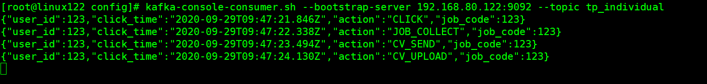

## configuring nginx, ngx_kafka_module

1. install git
```bash
yum install -y git
```

2. install dependency
```bash
yum install -y gcc gcc-c++ zlib zlib-devel openssl openssl-devel pcre pcre-devel

cd /opt/software
```

3. clone kafka c client
```bash
git clone https://github.com/edenhill/librdkafka
```

4. go to librdkafka and compile it
```bash
cd /opt/software/librdkafka
./configure
make && make install
```

5. install nginx
```bash
cd /opt/software
wget http://nginx.org/download/nginx-1.18.0.tar.gz
tar -zxf nginx-1.18.0.tar.gz
```

6. clone lib for ngx_module_kafka, and compile with the additional module `ngx_module_kafka`
```bash
cd /opt/software
git clone https://github.com/brg-liuwei/ngx_kafka_module
cd /opt/software/nginx-1.18.0
./configure --add-module=/opt/software/ngx_kafka_module/
make && make install
```

## configuring & running nginx server (host `linux122` mapped to `192.168.80.122`)
- installed nginx server by default will be at `/usr/local/nginx`
  ```bash
  vi /usr/local/nginx/conf/nginx.conf
  ```
- folowing is the config file
  ```bash
  # todo
  #user  nobody;
  worker_processes  1;

  #error_log  logs/error.log;
  #error_log  logs/error.log  notice;
  #error_log  logs/error.log  info;

  #pid        logs/nginx.pid;


  events {
      worker_connections  1024;
  }


  http {
      include       mime.types;
      default_type  application/octet-stream;

      sendfile        on;
      #tcp_nopush     on;

      #keepalive_timeout  0;
      keepalive_timeout  65;

      kafka;
      kafka_broker_list linux122:9092;

      server {
          listen       8808;
          server_name  192.168.80.122;

          location / {
              root   html;
              index  index.html index.htm;
          }

    # kafka log path
    location /kafka/log {
        kafka_topic tp_individual;
    }
          error_page   500 502 503 504  /50x.html;
          location = /50x.html {
              root   html;
          }
      }

  }

  ```
- start nginx server, will get error `error loading shared libraries: librdkafka.so.1`
  ```bash
  cd /usr/local/nginx/sbin
  ./nginx
  # ./nginx: error while loading shared libraries: librdkafka.so.1: cannot open shared object file: No such file or directory
  ```
- fixing the error, referred [git repo link](https://github.com/edenhill/librdkafka/issues/466)
  ```bash
    #Boot up loading /usr/local/lib library below
    echo "/usr/local/lib" >> /etc/ld.so.conf
    #Manual loading
    ldconfig

    # starting the server again
    ./nginx
  ```

## Running

1. start zk server
```bash
zkServer.sh start
```

2. start kafka
```bash
kafka-server-start.sh -daemon config/server.properties
```

3. create kafka topic `tp_individual`
```bash
kafka-topics.sh --zookeeper 192.168.80.122:2181/myKafka --create --topic tp_individual --partitions 3 --replication-factor 1
```

4. run kafka consumer
```bash
kafka-console-consumer.sh --bootstrap-server 192.168.80.122:9092 --topic tp_individual
```

5. using the `index.html` to test the log
  > **html demo:** 
  > 
  > **result:** 
