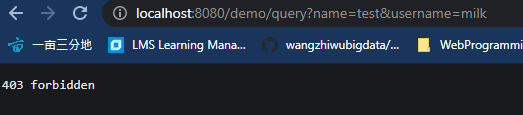

# Results

Implemented a `@Security` annotation for Spring MVC controller classes and controller handling method

# Steps

1. develop annotation class:

   ```java
   package com.lagou.edu.mvcframework.annotations;
   
   import java.lang.annotation.*;
   
   @Documented
   @Target({ElementType.TYPE, ElementType.METHOD})
   @Retention(RetentionPolicy.RUNTIME)
   public @interface Security {
       String[] value();
   }
   
   ```

2. adding a security related field for Handler instance:

   ```java
   public class Handler {
       //....
       private Set<SecurityRole> securityRoles;
   
       public Set<SecurityRole> getSecurityRoles() {
           return securityRoles;
       }
   
       public void setSecurityRoles(Set<SecurityRole> securityRoles) {
           this.securityRoles = securityRoles;
       }
       //...
   }
   ```

   `SecurityRole` is a wrapper around permitted role that can access the method under the handler:

   ```java
   public class SecurityRole {
       private String permittedUserName;
   
       public SecurityRole(String permittedUserName) {
           this.permittedUserName = permittedUserName;
       }
   
       public String getPermittedUserName() {
           return permittedUserName;
       }
   
       public void setPermittedUserName(String permittedUserName) {
           this.permittedUserName = permittedUserName;
       }
       
       @Override
       public boolean equals(Object o) {
           if (this == o) return true;
           if (o == null || getClass() != o.getClass()) return false;
           SecurityRole that = (SecurityRole) o;
           return permittedUserName.equals(that.permittedUserName);
       }
   
       @Override
       public int hashCode() {
           return Objects.hash(permittedUserName);
       }
   }
   ```

3. add logic in scanning & initialize the dispatcher servlet:

   ```java
   public class LgDispatcherServlet extends HttpServlet {
       private void initHandlerMapping() {
           Class<?> aClass = entry.getValue().getClass();
       	//....
           for(Map.Entry<String,Object> entry: ioc.entrySet()) {
               //...
               Method[] methods = aClass.getMethods();
               for (int i = 0; i < methods.length; i++) {
                   //...
                   //parse security annotations
                   Set<SecurityRole> securityRoles = parseSecurityRoles(aClass, method);
                   handler.setSecurityRoles(securityRoles);
                   //...
                   handlerMapping.add(handler);
               }
           }
           //...
       }
   
       /**
       * given a controller class and its method, populate the set of permittted roles that can access this
       * controller method 
       */
       private Set<SecurityRole> parseSecurityRoles(Class<?> aClass, Method method) {
           Set<SecurityRole> set = new HashSet<>();
   
           if (aClass.isAnnotationPresent(Security.class)) {
               Security classSecurityAnnotation = aClass.getAnnotation(Security.class);
               String[] classSecurityAnnotationValues = classSecurityAnnotation.value();
               if (classSecurityAnnotationValues != null) {
                   for (String roleName : classSecurityAnnotationValues) {
                       set.add(new SecurityRole(roleName));
                   }
               }
           }
   
           if (method.isAnnotationPresent(Security.class)) {
               Security methodSecurityAnnotation = method.getAnnotation(Security.class);
               String[] methodSecurityAnnotationValues = methodSecurityAnnotation.value();
               if (methodSecurityAnnotationValues != null) {
                   for (String roleName : methodSecurityAnnotationValues) {
                       set.add(new SecurityRole(roleName));
                   }
               }
           }
           return set;
       }
   }
   
   ```

   

4. adding the controller logic: check the security rules, only allow roles that are permitted to access the url

   ```java
   public class LgDispatcherServlet extends HttpServlet {
   
       private static final String SECURITY_ROLE_PARAM_NAME = "username";
   	
       @Override
       protected void doPost(HttpServletRequest req, HttpServletResponse resp) throws ServletException, IOException {
       	//....
           Map<String, String[]> parameterMap = req.getParameterMap();
   
           //check security roles
           Set<SecurityRole> allowedUserNames = handler.getSecurityRoles();
           String[] requestedUserNames = parameterMap.get(SECURITY_ROLE_PARAM_NAME);
           if (!allowRoleAccess(allowedUserNames, requestedUserNames)) {
               System.out.println("user access denied");
               resp.getWriter().write("403 forbidden");
               return;
           }
           System.out.println("access allowed, requesting users: " + requestedUserNames);
           //...
       }
       
       
       private boolean allowRoleAccess(Set<SecurityRole> allowedUserNames, String[] requestedUserNames) {
           if (allowedUserNames == null || allowedUserNames.isEmpty()) {
               return true;
           } else if (requestedUserNames == null || requestedUserNames.length == 0) {
               return false;
           }
   
           for (String requestedUserName : requestedUserNames) {
               SecurityRole requestedRole = new SecurityRole(requestedUserName);
               if (allowedUserNames.contains(requestedRole)) {
                   return true;
               }
           }
           return false;
       }
   }
   ```

   

# Test

Controller class:

```java
@LagouController
@LagouRequestMapping("/demo")
@Security(value={"eddie", "mako"})
public class DemoController {


    @LagouAutowired
    private IDemoService demoService;


    /**
     * URL: /demo/query?name=lisi
     * @param request
     * @param response
     * @param name
     * @return
     */
    @LagouRequestMapping("/query")
    @Security(value={"john"})
    public String query(HttpServletRequest request, HttpServletResponse response,String name) {
        return demoService.get(name);
    }
}
```

testing url: `http://localhost:8080/demo/query?name=test&username=eddie`

console log: 

```
lagou mvc 初始化完成....
access allowed
service 实现类中的name参数：test
```


testing url: `http://localhost:8080/demo/query?name=test&username=milk`



```java
lagou mvc 初始化完成....
user access denied
```

