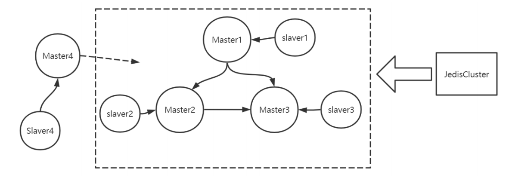
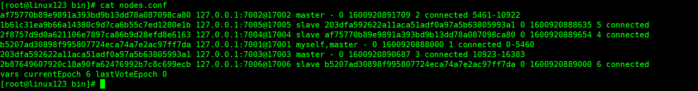
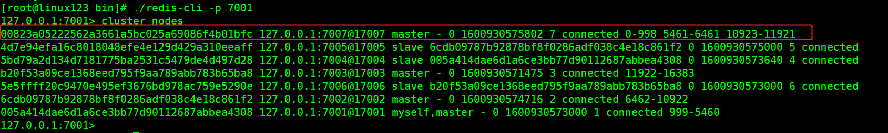
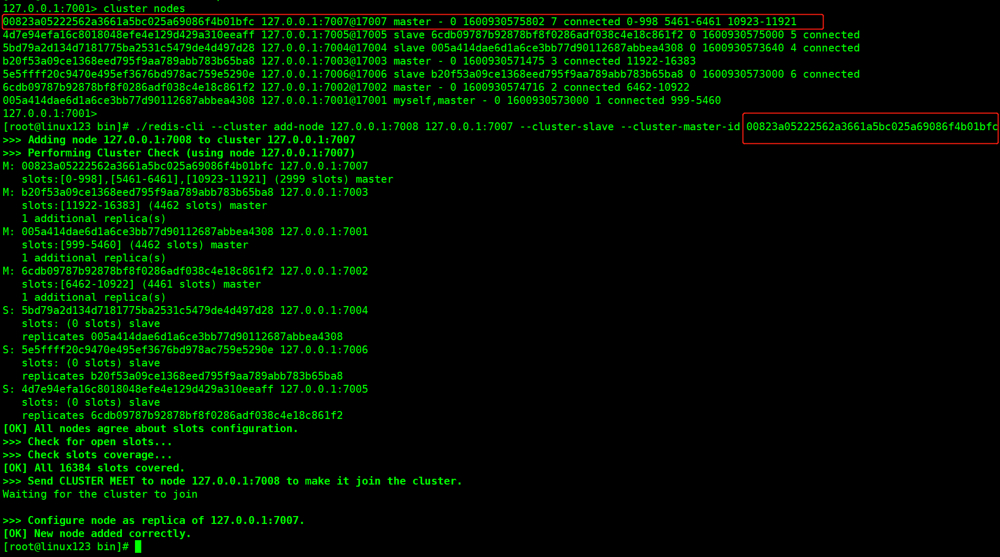
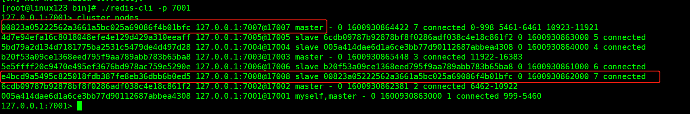

# Redis Cluster
- requirements:

## create cluster containing 6 nodes
- dependency:
  - master 7001 - slave 7005
  - master 7002 - slave 7004
  - master 7003 - slave 7006

```bash
./redis-cli --cluster create 127.0.0.1:7001 127.0.0.1:7002 127.0.0.1:7003 127.0.0.1:7004 127.0.0.1:7005 127.0.0.1:7006 --cluster-replicas 1
```
- Following is the cluster config after setting up the cluster


## add 7007 master into cluster of {7001 ... 7006}
```bash
# add 7007 master
./redis-cli --cluster add-node 127.0.0.1:7007 127.0.0.1:7001
```
- results:
```bash
[root@linux123 bin]# ./redis-cli --cluster add-node 127.0.0.1:7007 127.0.0.1:7001
>>> Adding node 127.0.0.1:7007 to cluster 127.0.0.1:7001
>>> Performing Cluster Check (using node 127.0.0.1:7001)
M: 005a414dae6d1a6ce3bb77d90112687abbea4308 127.0.0.1:7001
   slots:[0-5460] (5461 slots) master
   1 additional replica(s)
S: 4d7e94efa16c8018048efe4e129d429a310eeaff 127.0.0.1:7005
   slots: (0 slots) slave
   replicates 6cdb09787b92878bf8f0286adf038c4e18c861f2
S: 5bd79a2d134d7181775ba2531c5479de4d497d28 127.0.0.1:7004
   slots: (0 slots) slave
   replicates 005a414dae6d1a6ce3bb77d90112687abbea4308
M: b20f53a09ce1368eed795f9aa789abb783b65ba8 127.0.0.1:7003
   slots:[10923-16383] (5461 slots) master
   1 additional replica(s)
S: 5e5ffff20c9470e495ef3676bd978ac759e5290e 127.0.0.1:7006
   slots: (0 slots) slave
   replicates b20f53a09ce1368eed795f9aa789abb783b65ba8
M: 6cdb09787b92878bf8f0286adf038c4e18c861f2 127.0.0.1:7002
   slots:[5461-10922] (5462 slots) master
   1 additional replica(s)
[OK] All nodes agree about slots configuration.
>>> Check for open slots...
>>> Check slots coverage...
[OK] All 16384 slots covered.
>>> Send CLUSTER MEET to node 127.0.0.1:7007 to make it join the cluster.

```

## reshared for node 7007
```bash
# reshard
# size of shard slots = 3000, receving node id = 7007's id, receving from= all
./redis-cli --cluster reshard 127.0.0.1:7007
```
- results:
> 

## add slave node 7008 to master 7007
```bash
# add 7008 slave to 7007
./redis-cli --cluster add-node 127.0.0.1:7008 127.0.0.1:7007 --cluster-slave --cluster-master-id redis7007id
```
- results:
> 
> 
> 