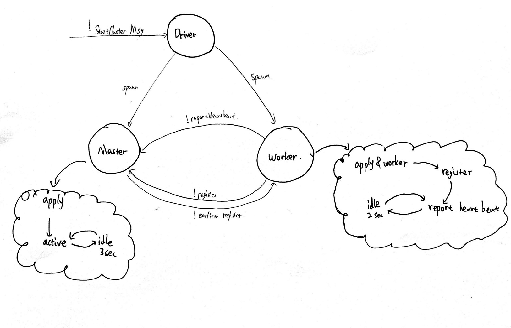

# Part 4 output

```
INFO  Slf4jLogger:105 - Slf4jLogger started
INFO  BActor$:35 - Actor[akka://Part4Homework/user/aActor#1703819990]: sends message with content: starting message!
INFO  AActor$:19 - Actor[akka://Part4Homework/user/bActor#1493313262]: sends message with content: BACtor message counter is currently: 1
INFO  BActor$:35 - Actor[akka://Part4Homework/user/aActor#1703819990]: sends message with content: AACtor message counter is currently: 1
INFO  AActor$:19 - Actor[akka://Part4Homework/user/bActor#1493313262]: sends message with content: BACtor message counter is currently: 2
INFO  BActor$:35 - Actor[akka://Part4Homework/user/aActor#1703819990]: sends message with content: AACtor message counter is currently: 2
INFO  AActor$:19 - Actor[akka://Part4Homework/user/bActor#1493313262]: sends message with content: BACtor message counter is currently: 3
```

# Part5

## FSM



## Output

```scala
initializing the cluster ....
Driver: spawning master....
Driver: spawning worker 1....
worker 1 registering self to the cluster .....
master receives register request from worker Actor[akka://MasterWorkerCluster/user/worker_1#-81899919] at time 2020-11-17 22:43:27
worker 1's registration confirmed by the master .....
........updated worker map: HashMap(Actor[akka://MasterWorkerCluster/user/worker_1#-81899919] -> 2020-11-17 22:43:27)
Driver: spawning worker 2....
worker 2 registering self to the cluster .....
master receives register request from worker Actor[akka://MasterWorkerCluster/user/worker_2#1888545351] at time 2020-11-17 22:43:29
worker 2's registration confirmed by the master .....
........updated worker map: HashMap(Actor[akka://MasterWorkerCluster/user/worker_2#1888545351] -> 2020-11-17 22:43:29, Actor[akka://MasterWorkerCluster/user/worker_1#-81899919] -> 2020-11-17 22:43:27)
worker 1 reporting heartbeat at time 2020-11-17 22:43:29 .....
master updating worker map .....
worker 2 reporting heartbeat at time 2020-11-17 22:43:31 .....
worker 1 reporting heartbeat at time 2020-11-17 22:43:31 .....
```

