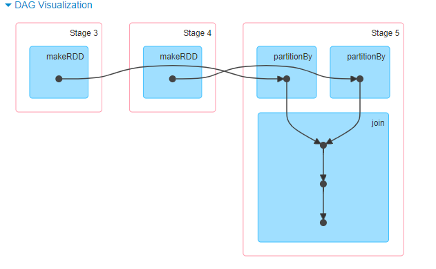

```scala
val rdd3: RDD[(Int, (String, String))] = rdd1.join(rdd2)println(rdd3.dependencies)
```



- 这里join是宽依赖，因为对join中record key的处理需要用到shuffle(计算每个key的hash并发到对应的reducer上)，因此join是shuffle boundary, 也就会使得其是宽依赖


```scala
val rdd4: RDD[(Int, (String, String))] = rdd1.partitionBy(new HashPartitioner(3)).join(rdd2.partitionBy(newHashPartitioner(3)))
```


- 这里join是窄依赖，原因在于再join前rdd中每个record已经被发送到了对应的partition中，因此partitionBy是宽依赖，之后的join可以在分区内进行，因此join是窄依赖