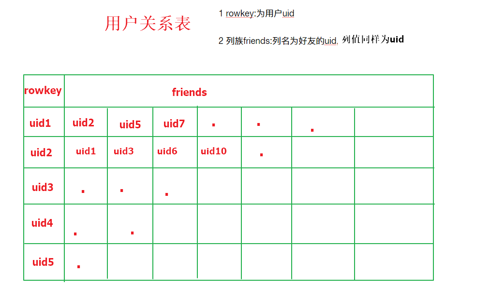

## Hbase作业

在社交网站，社交APP上会存储有大量的用户数据以及用户之间的关系数据，比如A用户的好友列表会展示出他所有的好友，现有一张Hbase表，存储就是当前注册用户的好友关系数据，如下

需求

1. 使用Hbase相关API创建一张结构如上的表

2. 删除好友操作实现（好友关系双向，一方删除好友，另一方也会被迫删除好友）

   例如：uid1用户执行删除uid2这个好友，则uid2的好友列表中也必须删除uid1

